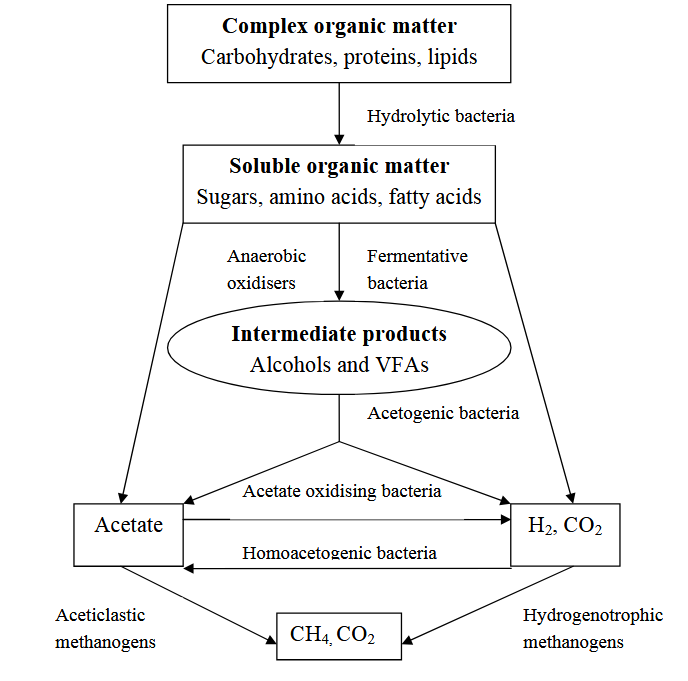
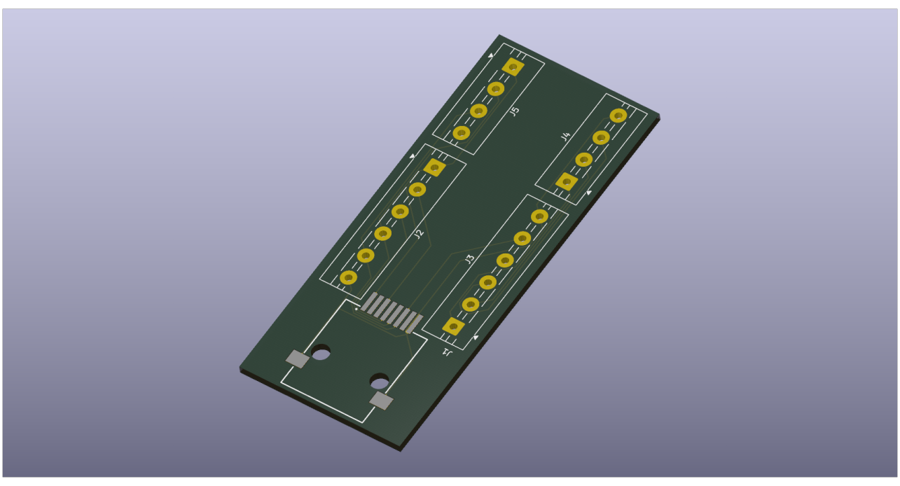
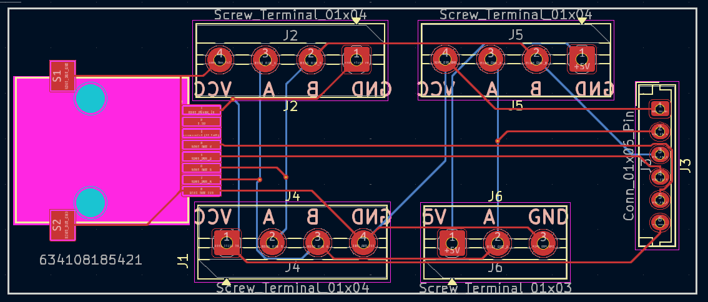
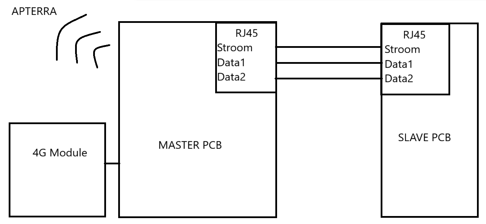
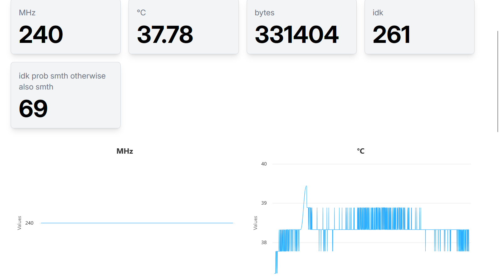
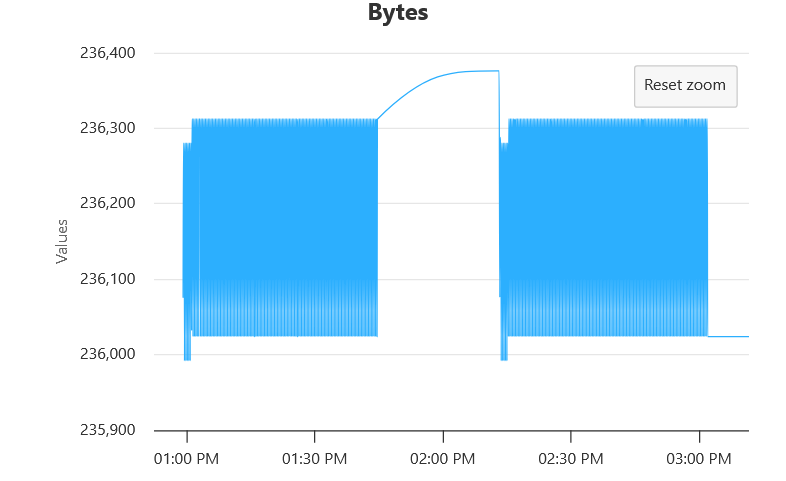

# IOT Biogasmetingen

## Biogasgroep: 2 

#### Opleiding: 3ITIOT1

#### Academiejaar: 2025-2026

#### studenten: Mathias Vansteensel, Berre Neyrinck

#### projectverantwoordelijke: Dirk van Merode  

# Table of contents:

- [IOT Biogasmetingen](#iot-biogasmetingen)
  - [Biogasgroep: 2](#biogasgroep-2)
      - [Opleiding: 3ITIOT1](#opleiding-3itiot1)
      - [Academiejaar: 2025-2026](#academiejaar-2025-2026)
      - [studenten: Mathias Vansteensel, Berre Neyrinck](#studenten-mathias-vansteensel-berre-neyrinck)
      - [projectverantwoordelijke: Dirk van Merode ](#projectverantwoordelijke-dirk-van-merode)
- [Table of contents:](#table-of-contents)
  - [Vakjargon](#vakjargon)
- [Introductie](#introductie)
  - [Huidige situatie](#huidige-situatie)
  - [Info over Ardhi University](#info-over-ardhi-university)
  - [Probleemstelling](#probleemstelling)
  - [Voorgestelde oplossing](#voorgestelde-oplossing)
- [Componentkeuzes:](#componentkeuzes)
    - [Bill of Materials (BOM)](#bill-of-materials-bom)
      - [CO₂/CH₄-vergelijking](#coch-vergelijking)
      - [waterlevelsensor vergelijking](#waterlevelsensor-vergelijking)
      - [Temperatuursensor vergelijking](#temperatuursensor-vergelijking)
      - [Druksensor vergelijking](#druksensor-vergelijking)
- [Documentatie](#documentatie)
  - [Marktonderzoek](#marktonderzoek)
  - [Gasonderzoek](#gasonderzoek)
    - [Hydrolyse](#hydrolyse)
    - [Acidegonesis](#acidegonesis)
    - [Acetogenese](#acetogenese)
    - [Methanogenese](#methanogenese)
    - [Filtratiesysteem outputgas](#filtratiesysteem-outputgas)
  - [Gekozen sensoren](#gekozen-sensoren)
  - [Solar Power Manager - Waveshare](#solar-power-manager---waveshare)
  - [Datacommunicatie](#datacommunicatie)
    - [MQTT + AT-Commands](#mqtt--at-commands)
  - [Code werking](#code-werking)
  - [PCB Design](#pcb-design)
  - [Communicatie](#communicatie)
  - [APTerra](#apterra)
    - [APTerra Documentatie](#apterra-documentatie)
      - [APTerra Devices](#apterra-devices)
  - [Tegengekomen Problemen](#tegengekomen-problemen)
  - [Display APterra](#display-apterra)
  - [Bewijzen](#bewijzen)
    - [Bewijs: Sensordata flow tussen ESP32 \& APTerra](#bewijs-sensordata-flow-tussen-esp32--apterra)
      - [Te bewijzen](#te-bewijzen)
      - [Bewijs praktisch](#bewijs-praktisch)
      - [Bewijsconclusie \& foto's van resultaat](#bewijsconclusie--fotos-van-resultaat)
      - [Code gebruikt bij bewijs](#code-gebruikt-bij-bewijs)
    - [Bewijs: long-term testing van de ESP32-transmissievaardigheid](#bewijs-long-term-testing-van-de-esp32-transmissievaardigheid)
      - [Te bewijzen](#te-bewijzen-1)
      - [Bewijs praktisch](#bewijs-praktisch-1)
      - [Bewijsconclusie \& foto's van resultaat](#bewijsconclusie--fotos-van-resultaat-1)
      - [Code gebruikt bij bewijs](#code-gebruikt-bij-bewijs-1)
- [Bibliografie](#bibliografie)

  - [Biogasgroep: 2](#biogas-groep-2)

      - [Opleiding: 3ITIOT1](#opleiding-3itiot1)

      - [Academiejaar: 2025-2026](#academiejaar-2025-2026)

      - [studenten: Mathias Vansteensel, Berre Neyrinck](#studenten-mathias-vansteensel-berre-neyrinck)

      - [projectverantwoordelijke: Dirk van Merode](#projectverantwoordelijke-dirk-van-merode)

- [Table of contents:](#table-of-contents)

  - [Vakjargon](#vakjargon)

- [Introductie](#introductie)

  - [Huidige situatie](#huidige-situatie)

  - [Info over Ardhi University](#info-over-ardhi-university)

  - [Probleemstelling](#probleemstelling)

  - [Voorgestelde oplossing](#voorgestelde-oplossing)

- [Componentkeuzes:](#component-keuzes)

    - [Bill of Materials (BOM)](#bill-of-materials-bom)

      - [CO₂/CH₄-vergelijking](#co2ch4-vergelijking)

      - [waterlevelsensor vergelijking](#waterlevelsensor-vergelijking)

      - [Temperatuursensor vergelijking](#temperatuursensor-vergelijking)

      - [Druksensor vergelijking](#druksensor-vergelijking)

- [Documentatie](#documentatie)

  - [Marktonderzoek](#marktonderzoek)

  - [Gasonderzoek](#gasonderzoek)

    - [Hydrolyse](#hydrolyse)

    - [Acidegonesis](#acidegonesis)

    - [Acetogenese](#acetogenesis)

    - [Methanogenese](#methanongenesis)

    - [Filtratiesysteem outputgas](#filtratie-systeem-output-gas)

  - [Gekozen sensoren](#gekozen-sensoren)

  - [Solar Power Manager - Waveshare](#solar-power-manager---waveshare)

  - [Datacommunicatie](#datacommunicatie)

    - [MQTT + AT-Commands](#mqtt--at-commands)

    - [Code werking](#code-werking)

  - [PCB Design](#pcb-design)

  - [Communicatie](#communicatie)

  - [APTerra](#apterra)

    - [APTerra-documentatie](#apterra-documentatie)

      - [APTerra Devices](#apterra-devices)

  - [Tegengekomen problemen](#tegengekomen-problemen)

  - [Display APterra](#display-apterra)

  - [Bewijzen](#bewijzen)

    - [Bewijs: Sensordata flow tussen ESP32 & APTerra](#bewijs-sensordata-flow-tussen-esp32--apterra)

      - [Te bewijzen](#te-bewijzen)

      - [Bewijs praktisch](#bewijs-praktisch)

      - [Bewijsconclusie & foto's van resultaat](#bewijs-conclusie--fotos-van-resultaat)

            - [Code gebruikt bij bewijs](#code-gebruikt-bij-bewijs)

    - [Bewijs: long-term testing van de ESP32-transmissievaardigheid](#bewijs-long-term-testing-van-de-esp32-transmissie-vaardigheid)

      - [Te bewijzen](#te-bewijzen-1)

      - [Bewijs praktisch](#bewijs-praktisch-1)

      - [Bewijsconclusie & foto's van resultaat](#bewijs-conclusie--fotos-van-resultaat-1)

            - [Code gebruikt bij bewijs](#code-gebruikt-bij-bewijs-1)

- [Bibliografie](#bibliografie)

## Vakjargon

| Afkorting / Term | Betekenis |
|------------------|------------|
| IoT | Internet of Things – netwerk van fysieke apparaten die via internet gegevens verzamelen en uitwisselen. |
| RS-485 | Industriële communicatiestandaard voor seriële dataoverdracht tussen sensoren en controllers. |
| Modbus | Communicatieprotocol dat gebruikt wordt voor het verzenden van gegevens via RS-485 tussen meetinstrumenten en controllers. |
| MQTT | Lichtgewicht protocol voor datatransport tussen IoT-apparaten en een online dashboard of server. |
| APTerra | Online platform waarop sensordata van het IoT-systeem visueel weergegeven wordt. |
| Biogas | Gasmengsel (hoofdzakelijk methaan en koolstofdioxide) dat ontstaat door de vergisting van organisch afval. |
| CH₄ (Methaan) | Hoofdbestanddeel van biogas; brandbaar gas dat energie levert bij verbranding. |
| CO₂ (Koolstofdioxide) | Gas dat samen met methaan ontstaat tijdens vergisting; niet-brandbaar. |
| Digester / Vergister | Afgesloten tank waarin biologisch afval onder anaerobe omstandigheden wordt afgebroken tot biogas. |
| Anaeroob proces | Biologisch proces dat plaatsvindt zonder zuurstof, typisch voor biogasproductie. |
| Waterlevel sensor | Sensor die het vloeistofniveau in de vergister meet. |
| Temperatuursensor | Meetinstrument dat de temperatuur meet |
| Druksensor | Sensor die de gasdruk in een systeem meet |
| PCB (Printed Circuit Board) | printplaat waarop elektronische componenten gemonteerd zijn. |
| Ecovadis | Beoordelingssysteem dat bedrijven evalueert op duurzaamheid en maatschappelijk verantwoord ondernemen. |
| ATEX / IECEx | Certificeringsnormen die aanduiden dat apparatuur veilig is voor gebruik in explosiegevaarlijke omgevingen. |
| IP-rating (Ingress Protection) | Internationale standaard die de mate van bescherming van een apparaat tegen stof en water aangeeft. |
| Desulfurizer | Onderdeel dat zwavelhoudende gassen (zoals H₂S) uit biogas verwijdert. |
| Vochtvanger / Condensafscheider | Filter die waterdamp uit het biogas verwijdert om corrosie te voorkomen. |
| Compressor | Apparaat dat gas samenperst voor opslag in tanks. |
| Dashboard | Digitale gebruikersinterface waar de meetdata van het systeem in real time wordt weergegeven. |
| Kimbiji | Plaats in Tanzania waar de biogasinstallatie van het project zich bevindt. |
| Biomassa | Organisch materiaal (zoals plantaardig afval) dat als grondstof dient voor energieproductie. |
| VLIROUS | Vlaams samenwerkingsprogramma dat partnerschappen ondersteunt tussen Vlaamse en Afrikaanse universiteiten. |

# Introductie

## Huidige situatie

Dit project maakt deel uit van een groter project van Student for Energy in Afrika van Ardhi University en Vliruos. De meest gebruikte vorm van energie in Noord-, Oost- en West-Afrika is energie gecreëerd door het branden van kolen en hout. De stad van aanpak, Kimbiji, valt ook onder deze norm. 

Om de schakel te maken naar de veel groenere biomassa zijn er plannen om over heel Afrika, beginnend in de kleinere steden, bioreactors te plaatsen die de lokale bevolking van groene energie voorzien die gebruikt kan worden als substituut voor hun huidige kool- en olie-energie. Momenteel staat er een volledige biogasplant geïnstalleerd in Kimbiji die lokaal groenafval, fecale materie en andere soorten afval gebruikt in een anaerobisch systeem om het afval te laten verteren en om te zetten in biogas en inerte biomassa. Het geproduceerde gas wordt dan naar buiten gesluisd door een filtratiesysteem dat de biogascombinatie van CO₂, CH₄ en enige resterende gassen door meerdere filters zal brengen, met als eindproduct een zo zuiver mogelijk CH₄-rijk gas dat ze comprimeren in gasflessen aan het einde van de cyclus.

De resterende, interte biomassa kan afgevoerd worden om te dienen als mest en het bewerkte water kan zijn nut vinden in industriële processen of zelfs irrigatie voor planten om meer biomassa te genereren. Deze opstelling werkt momenteel al aan een bepaalde efficiëntie, maar deze valt niet te meten, aangezien het volledige systeem geen enkel digitaal meetpunt bevat dat data opslaat voor toekomstige verbetering. Om lokale bewoners te overtuigen hun bioafval af te geven aan de plantage zal er een initiatief opgesteld worden dat als bewoners hun bioafval naar de bioreactor brengen ze een kleine hoeveelheid methaangas in ruil krijgen.

## Info over Ardhi University

Ardhi University is een publieke universiteit die aanwezig is in Dar es Salaam. Zij zijn ook ineens de organisator van meerdere biogasreactorprojecten rondom Dar es Salaam zelf. De universiteit werkt samen met AP-hogeschool en Uhasselt in een energieproject dat biogasreactoren gebruikt om biologisch afval zoals keukenresten, boomafval en fecale materie om te vormen naar een rauw biogas en dit te filteren naar bruikbare, schone energie.

Momenteel bezit Ardhi een redelijke hoeveelheid bioreactoren van kleine 8L-digesters tot meer dan 1000+ liter-installaties.

## Probleemstelling

De hoeveelheid methaanrijk biogas die wordt geproduceerd is momenteel ongemeten. Hierdoor weten we niet exact hoe efficiënt het volledige proces is. De hoeveelheid water aanwezig in de bioafvalverteerder ten opzichte van de hoeveelheid biomassa is momenteel ook niet opgemeten. Dit, tezamen met een onbekende temperatuur, zorgt voor een incompleet overzicht van het volledige proces, waardoor er mogelijke verbeteringen over het hoofd worden gezien. Er zal een volledig meetsysteem moeten komen dat het biogas over meerdere punten opmeet tijdens het proces en deze data kan opsturen naar een dashboard. Met een complete meetopstelling maken we het mogelijk de bioreactor te monitoren en te optimaliseren, alsook een leesbare output te creëren voor de data, zoals de hoeveelheid CH4 in het eindproduct, te bekijken.

## Voorgestelde oplossing

Wij ontwerpen een systeem dat in de digester metingen zal uitvoeren.

In de ton zelf hebben we een CO₂/CH₄-sensor om een volumemeting te doen van de gassen en op deze manier te achterhalen in welke stage van vertering we zitten. Een temperatuurmeter zal geïnstalleerd worden die ons kan helpen de efficiëntie van de productie van het biogas te berekenen. Een drukmeter en een waterlevelmeter zullen gebruikt worden om ons te vertellen of er te weinig bioafval of water in de verdeerder zit en ons zo notificeren dat mogelijk een van beide moet bijgevuld worden.    

# Componentkeuzes:

### Bill of Materials (BOM)

| Naam | Kost | Hoeveelheid | Link naar artikel |
| ----- | ----- | ----- | ----- |
| Firebeetle WROOM V2 | 16,36$ | 1 | [LINK](https://benl.rs-online.com/web/p/arduino-compatible-boards-kits/2473219?cm_mmc=BE-PLA-DS3A-_-google-_-CSS_BENL_NL_Pmax_1224-_--_-2473219&matchtype=&&gclsrc=aw.ds&gad_source=1&gad_campaignid=22040006570&gclid=CjwKCAiAuIDJBhBoEiwAxhgyFuIoyhnAeTN-a6PcChIT0EpC9Am6lveoA97EagpxEp1wtjasvj7d2hoC6_gQAvD_BwE) |
| Power management module | 18,99$ | 1 | [LINK](https://www.amazon.com.be/-/en/Waveshare-Management-Protection-Controller-Environmental/dp/B094FWZVFH/ref=sr_1_2?adgrpid=159150164620&dib=eyJ2IjoiMSJ9.-7uAVmJb6Q2IoRJlDG2jZxfqE3feKhcpABjlgmcOI_q-jf5bFsbR13tlN4E3IH_5rfy7pfGtnpTTycywrak_AowxqEfIUH5-Vtkq5tnqM-4ICpxMb3_2ryCOEAQgj1R21MRgbJlpGvsUWWGCxSr5vVOAosyYzMMztZpOxvvB5kqn_90rnCy6Np-fRpd6dQVk8EZfTos21ivpUewuBwCE23GU1iV5usYjbkdZeWX3z-J_zIRwlPY_mEia5XwOSD2wJrYKJNBBWRAx27FxBxJUEj7DaKGvFANNIWVS77L-Jec.SNQBdjrmV2BTxfnSwooLobFmH6_XcF5-ozsu4SXOzys&dib_tag=se&gad_source=1&hvadid=689276129506&hvdev=c&hvlocphy=9195878&hvnetw=g&hvqmt=e&hvrand=95786312923268170&hvtargid=kwd-1188393181890&hydadcr=22453_2319041&keywords=waveshare+solar+power+manager&mcid=22da17078e243cdcada981499cc22827&qid=1763713271&sr=8-2) |
| zonnepaneel AP-gekozen | 32,99$ | 1 | TBD |
| CBW Water-Resistant Digital Temperature Sensor | 24,99 | 1 | [LINK](https://controlbyweb.com/accessories/temperature-probe/) |
| ANTRATEK 750cm waterlevel sensor | 30,13$ | 1 | [LINK](https://www.antratek.be/rs485-750cm-ultrasonic-level-sensor?utm_source=google&utm_medium=cpc&utm_campaign=**Pmax%20shopping%20-%20BE&utm_id=21792943403&gad_source=1&gad_campaignid=21786496926&gclid=CjwKCAiAuIDJBhBoEiwAxhgyFho_ZDgAMGiGCt2ahdCN1k3Aabqb8qdzxSV2KZTifyXQ2oIeflyrpBoCCCYQAvD_BwE) | 
| PREMASGARD® SHD-Modbus 2.5 LCD | 551,75$ | 1 | [LINK](https://www.spluss.de/en/products/pressure-measuring-transducer-premasgard-shd-modbus-2-5-lcd-0-2-5-bar-1301-2214-5530-221-p22881?_pos=1&_fid=6c2a87c96&_ss=c) |

#### CO₂/CH₄-vergelijking

|| MGP261 | MGP262 | ATO-ICDS-7042A | cubic CH4 sensor | GFG IR29 B | M2A-XL Stand Alone Transmitter | 
| -------- | ------- | ------- | ----- | ----- | ----- | ----- |
| CH4 Range                     | 0-100% vol | 0-5% vol | 0-100% lel | 0-100% vol | 0-100% LEL | 0-100% vol |
| CO2 Range                     | 0-100% vol  | 0-100% | 0% | 0% | N/A | 0-100% |
| Accuracy                      | +- 1% | +-1% | 0.1% | +-6% | 0.1% | 2% |
| Ex-rating                     | Zone 0/1 | ATEX/IECEx  | Zone 1/2  | N/A | IP68 | NEMA 4X  |
| IP-rating                     | IP66 | IP66 | N/A | N/A | N/A | N/A |
| Humidity rating               | 0-100%RH | 0-100%RH | 0-95%RH| 0-95% | N/A | 5 - 95%| 
| communicatie                   | rs-485 modbus  | rs-485 modbus | UART | UART | rs-485 modbus | rs-485 modbus |
| prijs                         | Quote: 15.499$ | 99$ * 100 (bulkbestelling) | 992.31$ | 283.25$ | 1670$ | Quote:  |
| voltage                       | 18-30V DC | 18-30V DC | 5V DC | 3.3-5V DC | 18-30V DC | 24V DC |
| stroom                        | 20mA  | 20mA | 60mA | 55mA | N/A | N/A |
| sustainability rating         | Ecovadis top 5%  | Ecovadis top 5% | N/A | N/A | N/A | N/A |

#### waterlevelsensor vergelijking

|| ENELSAN Ultrasonic | VEGAPULS C11 | IJINUS waterlevel sensor | ANTRATEK 750cm waterlevel sensor | 
| -------- | ------- | ------- | ----- | ----- | 
| technologie               | ultrasonic | radar | ultrasonic | ultrasonic |
| IP-rating                 | IP65 | IP68 | IP68 | N/A (IEC61000-4-2) |
| communicatie              | rs-485 modbus | bluetooth | rs-485 modbus | rs-485 modbus |
| prijs                     | Quote: N/A | 550$ | Quote: N/A | 30.13$ |
| voltage                   | 6V DC | 12-35V DC | 5-30V DC internal battery | 5-12V DC |    
| stroom                    | 300mA | 20mA | N/A | <10mA |

#### Temperatuursensor vergelijking

|| Antratek FG6485A | Antratek 101991101 | CBW Water-Resistant Digital Temperature Sensor |
| -------- | ------- | ------- | ----- |
| Temp range                    | -40 - 120°C | -40 - 125°C | -55°C - 125°C | 
| Corrosion resistance          | N/A | N/A | stainless steel | stainless steel |
| Humidity rating               | 0-99.9%RH | 0-100%RH | N/A | N/A |
| Bar sensor                    | N/A | 300 - 1100 hPa | N/A | N/A |
| communicatie                  | rs-485 | rs-485 modbus | Analoge | 1-wire | 
| prijs                         | 60,38$ | 72,54$ | 32,99$ | 24,99$ | 
| voltage                       | 9-36V DC | 4.5-18V DC | 3.3Vmin | 5V DC |
| stroom                        | 15mA | 10mA | N/A | N/A |

#### Druksensor vergelijking

|| PREMASGARD® SHD-Modbus 2.5 LCD |
| ----- | ----- |
| barmeting | 0-2,5 bar |
| accuracy | 0,2% |
| voltage | 0-10VDC |
| temp range | -20~75°C |
| IP-rating | IP65 |

# Documentatie

## Marktonderzoek

In België zijn er een grote hoeveelheid verenigingen die puur en alleen over biogas en biomethaan gaan. Een aantal van deze verenigingen hosten ook bijeenkomsten waar je “vrij” naartoe kan, mits je een ticket aankoopt. De meeste onderwerpen die voorbij komen tijdens deze evenementen zijn eerder wat bedrijven hun werkproces is of wat voor soorten biogasmetingen ze uitvoeren. 

Er zijn een heel aantal bedrijven die zich bezighouden met biogas waar je extra informatie aan kunt vragen. Dit zal dan ook mogelijk zeer handig zijn om diepere kennis te vergaren van de industriële werking van biogasgeneratie. Een zo'n bedrijf is bijvoorbeeld Inagro, dat sinds kort een groot project heeft afgesloten waarbij ze volledige testopstellingen en ontledingen deden voor het biogasproductie- en meetproces.

| Bedrijf / Conventie | Link |
| -------- | ------- |
| Inagro                    | https://inagro.be/projecten/biogas-mambo |
| EUBioweek                 | https://www.europeanbiomethaneweek.eu/   |
| bright-renewables         | https://www.bright-renewables.com/       |

## Gasonderzoek



Voorbeelddiagram conversie bioafval naar CH4, CO2 en reststoffen

| Verzameling thesis- en onderzoekslinks:| |
| ----- | ----- | 
| Cheng Denmark University | [Thesis PDF](https://backend.orbit.dtu.dk/ws/portalfiles/portal/5245572/ENV2010-283.pdf) |
| Thesis UHasselt Corthouts, Vanhoudt | [Thesis PDF ](https://documentserver.uhasselt.be/bitstream/1942/35064/1/e4357d7c-3aea-4cc1-a09b-78bb3e2e0138.pdf)|

Het proces dat we gaan bekijken is een "anaeroob proces". Wat simpelweg betekent dat dit een luchtvrij systeem is waar bacteriën het bioafval afbreken in simpele stoffen die zich weer samen zullen voegen, tot er uiteindelijk een stabiel gas "CH4 of CO2" uitkomt.

### Hydrolyse

De eerste stap in het vergisten van het complexe bioafval is de hydrolyse Het hydrolyseproces in het systeem zal ervoor zorgen dat de bacteriën deze materie afbreken in simpele stoffen zoals: suikers, acetaten, enzymen, vetzuren en aminozuren. Deze materialen zullen de basis vormen van onze methaanproductie in de digester van de biogasreactor. 

### Acidegonesis 

Eenmaal afgebroken, zullen de fermentatieve bacteriën deze simpele materies omvormen naar: waterstof, ammonia en onverzadigd vetzuur. 

### Acetogenese

Onverzadigd vetzuur zal zich weer opsplitsen in meerdere delen materie, namelijk: acetaten, koolstofdioxide (CO₂) en waterstof. Deze acetaten en waterstof zullen in de volgende fase samenbinden om als product methaangas (CH4) op te leveren. 

### Methanogenese

Als de laatste stap zullen methanogene bacteriën deze acetaten en waterstof samenbinden tot methaan. Deze conversie is alleszins niet perfect, aangezien een bijproduct van de binding nog meer CO₂ is.

Tegen het einde van de cyclus, ervan uitgaande dat onze reactor schommelt tussen 40°C en 90°C, zullen we een schattelijk eindproduct krijgen van 65% CH4 en 35% CO2, inclusief reststoffen die er later uit gefilterd moeten worden.

### Filtratiesysteem outputgas

Het gasproduct dat geproduceerd wordt door de digester zal door een uitlaat aan de bovenkant van de digester door een filtratiesysteem gestuurd worden Eerst zal het rauwe biogas door een vochtvanger gaan die enige overblijfselen van waterdamp uit het gas haalt. Hierna zal de mix door een "desulfurizer" gaan die enige aanwezigheid van H2S zal verwijderen uit de mix om deze daarna naar een compressor en gasdebietmeter om het resterende gas op te slaan.

## Gekozen sensoren

||Component|reden|link| prijs |
|------|---------|-------| | |
|CO₂/CH₄| Nog te bepalen | | | |
| Waterlevel sensor | RS485 750cm Ultrasonic Level Sensor | Mogelijke uitbreidingsmogelijkheden & precieze resolutie | [LINK](https://www.antratek.be/rs485-750cm-ultrasonic-level-sensor?utm_source=google&utm_medium=cpc&utm_campaign=**Pmax%20shopping%20-%20BE&utm_id=21792943403&gad_source=1&gad_campaignid=21786496926&gclid=CjwKCAiAraXJBhBJEiwAjz7MZaTOe1ODPodRPymIbMsYi_lZ0X0MeJzXyM4Ad2MUsQ6_v71vo3egPRoC53UQAvD_BwE) | 30,13$ |
|temperatuursensor | CBW Water-Resistant Digital Temperature Sensor | beste temp range, goede prijs-kwaliteit, roestbestendig | [LINK](https://controlbyweb.com/accessories/temperature-probe/) | 24.99$ |
| drukmeter | PREMASGARD® SHD-Modbus 2.5 LCD | modbus-output, grote bar-meting, goede Atex-proofing | [LINK](https://www.spluss.de/en/products/pressure-measuring-transducer-premasgard-shd-modbus-2-5-lcd-0-2-5-bar-1301-2214-5530-221-p22881?_pos=1&_fid=6c2a87c96&_ss=c) | 551,75$ |

## Solar Power Manager - Waveshare

De Waveshare Solar Power Management Module is een powermanager voor 6V-24V-zonnepanelen. Het is ontworpen om een 3.7V Li-ionbatterij op te laden met behulp van zonne-energie. De module gebruikt een MPPT-techniek om het zonnepaneel optimaal te benutten en er de maximale hoeveelheid vermogen uit te halen. Het zorgt ervoor dat de batterij veilig en betrouwbaar wordt opgeladen en biedt ook een gestabiliseerde 5V-uitgang aan waarmee kleine elektronische apparaten zoals sensoren, microcontrollers of IoT-modules van stroom kunnen worden voorzien. De module kan daarnaast ook via USB worden gevoed en bevat de nodige beveiligingen tegen verkeerd aansluiten, overladen en over-ontladen. Hierdoor is het perfect geschikt voor gebruik in ons project om ervoor te zorgen dat onze componenten niet zonder stroom vallen.

Voor meer informatie kan de productinfo bekeken worden [hier](https://www.amazon.com.be/-/en/Waveshare-Management-Protection-Controller-Environmental/dp/B094FWZVFH/ref=sr_1_2?adgrpid=159150164620&dib=eyJ2IjoiMSJ9.-7uAVmJb6Q2IoRJlDG2jZxfqE3feKhcpABjlgmcOI_q-jf5bFsbR13tlN4E3IH_5rfy7pfGtnpTTycywrak_AowxqEfIUH5-Vtkq5tnqM-4ICpxMb3_2ryCOEAQgj1R21MRgbJlpGvsUWWGCxSr5vVOAosyYzMMztZpOxvvB5kqn_90rnCy6Np-fRpd6dQVk8EZfTos21ivpUewuBwCE23GU1iV5usYjbkdZeWX3z-J_zIRwlPY_mEia5XwOSD2wJrYKJNBBWRAx27FxBxJUEj7DaKGvFANNIWVS77L-Jec.SNQBdjrmV2BTxfnSwooLobFmH6_XcF5-ozsu4SXOzys&dib_tag=se&gad_source=1&hvadid=689276129506&hvdev=c&hvlocphy=9195878&hvnetw=g&hvqmt=e&hvrand=95786312923268170&hvtargid=kwd-1188393181890&hydadcr=22453_2319041&keywords=waveshare+solar+power+manager&mcid=22da17078e243cdcada981499cc22827&qid=1763713271&sr=8-2).

## Datacommunicatie

Bij dit project wordt er gebruikgemaakt van het communicatieprotocol "MQTT", oftewel "Message Queuing Telemetry Transport". Via MQTT kunnen we makkelijk subscriben op de topic van ons apparaat dat via APTerra gegeven wordt (zie tutorial). Ons transportprotocol zal 4G zijn via een ESP32-4G-addonmodule die een simkaart gebruikt om dit te realiseren. 

### MQTT + AT-Commands

Eerste tests waren uitgevoerd via een mobiele app genaamd "MyMQTT". Dit gaf ons een snelle manier om de connectiviteit tussen een sender en de APTerra-server te bekijken zonder enige opstelling of code. MyMQTT werkt door de topic op te geven waar er naar gestuurd moet worden en een text-promptveld om data in te zetten met een parameternaam. Dit heeft ons dan na een redelijk korte tijd al een eerste resultaat opgeleverd om te beginnen met MQTT.

De 4G-module hebben we eerst getest met een Arduino-prototypeprogramma dat simpele AT-commands invoerbaar maakt om zo te werken met de module. Mathias had nog een stuk code liggen dat hij hiervoor zeer snel kon retrofitten aan de 4G-module voor de ESP. Met een directe connectie van de module aan een laptop hebben we al snel een resultaat kunnen produceren voor onze module.

Onze tweede test die uitgevoerd werd op de 4G-module werd weer gedaan met prototypecode, maar dan in combinatie met de ESP-controller zelf Via een aantal Arduino-libraries, namelijk: SPI.h, PubSubClient.h en TinyGSMClient.h, heeft Mathias een "first prototype" gecreëerd dat een connectie vastlegt tussen de ESP-module en de 4G-module en dan een MQTT-connectie kan leggen tussen de ESP en de APTerra-server.

Dus in het kort: Success! Na een aantal minieme problemen hebben we succesvol een connectie kunnen maken tussen de 4G-module, de ESP32 en data kunnen doorsturen via MQTT naar de APTerra-server!

## Code werking

Full MQTT-stackprototype:

## PCB Design



Voor dit project is er gekozen om 2 PCB's te maken om zo beter onderscheid te creëren tussen componenten die in de gevaarlijke zone terechtkomen en degenen die er buiten opereren. De "Master" PCB heeft als taak data op te vragen van de Slave PCB, deze met stroom te voeden en deze, via een 4G-connectie, naar het APTerra-dashboard te sturen. De Slave PCB heeft als taak de inkomende stroom te verdelen over de componenten en de mogelijkheid te bieden om data terug te sturen naar de master PCB. 

De Slave PCB heeft een reeks connectorpins om makkelijk uit te breiden, mochten er wensen zijn voor nog meer sensoren te plaatsen.

De Master PCH beschikt over een Waveshare solar-power-manager-module die een Li-ionbatterij oplaadt om ons systeem constant van stroom te voorzien. Hierbovenop is er ook een RS-248-buscontroller aanwezig die zich voordoet als de driver voor de RS-248-bus. Deze chip bezit ook de mogelijkheid voor full-duplex als dit ooit in de toekomst gewild is, maar dient momenteel eerder als een "compatibility" chip tussen onze ESP32 en het RS-485-protocol.



## Communicatie 

De communicatie tussen onze componenten zal gebeuren via 2 PCB's Via een slave- en masterprincipe sturen we onze data naar de ESP32 en zo, met behulp van een 4G-module, naar de APTerra-server over het MQTT-protocol.

De Slave PCB in ons project zal alle componenten van stroom voorzien en data verzamelen via de RS-485-modbus van de componenten. rs-485-modbus werkt op een soort client-serverprincipe, waarbij we de master PCB een request kunnen laten sturen naar de clients om data op te halen. De connectie tussen ons master PCB-board en de slave zal gedaan worden via een RJ45-connector. We hebben RJ45 gekozen, omdat deze kabels makkelijker te maken zijn en de mogelijkheid hebben om UV-bestendig te zijn, bovenop een grotere hoeveelheid datalijnen om dingen zoals stroom, data of uitbreidingsmogelijkheden over te brengen.

rs-485 modbus gebruikt 2 datalijnen, omdat data doorgestuurd wordt in de vorm van een differentiaal tussen 2 geleiders. Dit maakt het systeem bestendig tegen externe ruis en effectief half-duplex. 




## APTerra

APTerra is het modulaire dashboard van AP, gemaakt door studenten van vorige jaren. Hierin zijn meerdere projecten en hun data beschikbaar om naar te kijken. Een van deze projecten, namelijk "Biogas #2", is waar wij onze data naartoe zullen sturen en vertonen in grafieken en dergelijke presentatiemethoden. Aangezien de documentatie van APTerra zeer schaars is, zullen wij proberen hier een kleine "how-to" te creëren om snel te werk te gaan met APTerra. 

### APTerra Documentatie

Met een stabiele internetconnectie, surf naar "https://www.apterra.be/" en klik op "Log in". Eenmaal hier wordt de gebruiker gevraagd login-credentials te geven. Deze credentials zijn je studenten-e-mail (vb. Berre.neyrinck@student.ap.be) en je wachtwoord dat gelinkt is aan je AP-hogeschoolaccount. Mogelijk is het nodig dat de leerkracht toegang verleent tot de werk-site van je project voordat je eenmaal devices kan aanmaken. Als dit eenmaal geregeld is, is het mogelijk om rechtsboven naar "My Projects" te gaan en zo een overzicht te krijgen van alle projecten waartoe jij rechten hebt.

Eenmaal dit afgerond is, kan je klikken op "Launch AP_Terra". Dit brengt je naar de "backend", waar je devices kan aanmaken en configureren, alsook inputdata van deze sensoren kan lezen in een grafiek of dergelijke.

#### APTerra Devices

Om een device aan te maken en zo een topic te krijgen voor datatransmissie, ga je naar: "Settings --> Create Device". Hierna wordt de gebruiker in een creation wizard gezet om hem door het proces te leiden van een apparaat configureren en klaar te maken voor gebruik.

De keuzes voor protocollen van het device zijn:

Soorten:

-  TTN Network 
-  Wifi or LTE device using MQTT 
-  Camera 
-  (TTN) Gateway 
  
Eenmaal het soort device gekozen is, wordt de gebruiker gevraagd naar een aantal extra informatiepunten, zoals: naam, descriptie, *send first argument as timestamp, image for device en location

"Send first argument as timestamp" wordt gebruikt bij situaties zoals: het device heeft data gemeten, maar kon deze niet direct opsturen. Door deze setting aan te klikken, wordt de eerste parameter doorgestuurd met een timestamp eraan gekoppeld om nog altijd accurate tijdsgebonden data te krijgen.

Na deze informatie in te geven, wordt de gebruiker gevraagd een aantal parameters in te geven. Deze parameters zullen het mogelijk maken verschillende soorten data naar APTerra te sturen en deze in grafieken te steken. De volgende pagina vraagt om een aantal parameters in te geven; de hoeveelheid komt hier overeen met de hoeveelheid data die doorgestuurd moet worden. 

Na al deze configuraties in te stellen, toont de site de naam van de server waarmee het device zich zal koppelen, alsook de title van het topic dat het device gebruikt om zijn data uit te lezen. Het is best hier een screenshot van te nemen, aangezien deze pagina niet terug opgeroepen kan worden.

Na aanvraag is er ook recentelijk een documentatiepagina voor APTerra geschreven: https://docs.apterra.be/#/AP-terra/manuals/sending-data

## Tegengekomen Problemen

De meeste sensoren die verkrijgbaar zijn en voldoen aan de lijst van vereisten worden meestal voorafgegaan door een quote aan te vragen bij het bedrijf. Dit is een zeer, zeer lang en uitputtend proces van back & forth, wat veel tijd in beslag neemt. Bij onze eerste sensor was de tijd om een quote te krijgen 3+ weken en een prijs van 14.999 $. 

Een aantal van de bedrijven waaraan een quote gevraagd werd, heeft ook simpelweg geen antwoord gegeven na meerdere malen proberen in contact te komen, wat voor frustraties kan zorgen. Samen met het internationale team hebben wij mails gestuurd naar bedrijven, instituten en ondernemingen die bezig zijn met biogas- en CH4-metingen, zonder enig succes in een CH4-sensor te vinden die betaalbaar genoeg is om in ons project te gebruiken.

Na een aantal weken wilden we opnieuw de APTerra-connectie testen met 4G, deze keer met een werkende Solarwave-powermanagementsensor. Toen we deze connecteerden, sprong er een flikkerend rood licht aan op de ESP32, wat we dachten dat een warning was. Na onderzoek te doen, betekent deze flikkerende LED dat de ESP32 geen geconnecteerde batterij detecteert (wat normaal was). Uiteindelijk zijn we erachter gekomen dat deze rode LED normaal was bij het uitvoeren van de opstelling en hadden wij hier onze tijd aan verspild.

Na een lange tijd testen waarom de werkende code niet meer werkt om communicatie te leggen met APTerra, zijn we erachter gekomen dat, bij het krijgen van onze simkaart, de SIM nog nooit geactiveerd was, wat betekent dat deze ook nooit gebruikt kan worden om data door te sturen. Na snel rond te vragen hoe anderen hun SIM geactiveerd hebben, hebben we al snel onze SIM werkende kunnen krijgen en verder kunnen gaan met de testopstelling.

## Display APterra


## Bewijzen

### Bewijs: Sensordata flow tussen ESP32 & APTerra

#### Te bewijzen

De ESP32 kan, met gebruik van het Waveshare-board, autonoom werken en data opnemen. Deze data zal verstuurd worden met behulp van de 7600G-H - 4G-module die de ESP32 van een

internetconnectie voorziet om zo via het MQTT-protocol de verzamelde rauwe data door te sturen naar APTerra, waar het in nummerformaat en grafiekformaat getoond wordt. De ESP32 kan werken zolang de li-ionbatterij van de Waveshare stroom voorziet.

#### Bewijs praktisch

Door de "esp_system.h"-library in Arduino/PlatformIO kunnen we bepaalde interne data van de ESP32 ophalen. Data zoals: vrije ruimte, temperatuur van de CPU, werkingsfrequentie en meer. Door deze data te nemen, kunnen we simpeler gaan testen zonder nood aan externe sensoren of dummydata (zoals van een externe ESP32).

We connecteren aan de ESP32 onze 4G-module aan de pinnen D10 (RX) en D11 (TX De 4G-module wordt van stroom voorzien door aan de screw terminal de '-' aan common ground te hangen en de '+' aan de VCC van de ESP32.)

De Waveshare-module zal de ESP, en dus consequent de 4G-module, van stroom voorzien. Momenteel bij deze test zal deze stroom enkel komen van een Li-ionbatterij en nog niet van een zonnepaneel, voor de simpliciteit van de test.

#### Bewijsconclusie & foto's van resultaat

De flow tussen de ESP32 en APTerra is aangetoond via dit bewijs door een mix van 5 parameters tegelijk door te sturen. Zoals

Data: 
- temperatuur CPU 
- werkfrequentie ESP32 
- 2 statische variabelen 
- momenteel vrije ruimte op de ESP32 

Deze data wordt "as is" doorgestuurd naar APTerra om hier extern enige mogelijke extra bewerkingen op te doen.



#### Code gebruikt bij bewijs

```cpp
#define USE_LTE true

#include <SPI.h>
#include <PubSubClient.h>
#include "esp_system.h"

#if USE_LTE

//#include <SoftwareSerial.h>
// ESP32 UART2 default pins: RX=16, TX=17
#define MODEM_RX 16  // Connect to SIM7600 TX
#define MODEM_TX 17  // Connect to SIM7600 RX
//SoftwareSerial SoftSerial;
#define SerialAT Serial2
#define TINY_GSM_MODEM_SIM7600 
#include <TinyGsmClient.h>

const char* apn      = "mworld.be";  
const char* gprsUser = "";
const char* gprsPass = "";
const char* simPIN = "1909";

TinyGsm modem(SerialAT);
TinyGsmClient gsmClient(modem);
PubSubClient client(gsmClient);

#else

#include <WiFi.h>
const char* ssid = "bletchley";
const char* password = "laptop!internet";
WiFiClient espClient;
PubSubClient client(espClient);

#endif

const char* mqtt_server = "bsaffer.iot-ap.be";
const char* topic = "device/8c549e7c-3383-429a-9d09-eb349e80d45d";

#if USE_LTE
void setup_Sim()
{
  SerialAT.begin(115200, SERIAL_8N1, MODEM_RX, MODEM_TX);
  delay(3000);

  Serial.println("Initializing modem...");

  int retries = 5;
  while (retries--) {
    if (modem.testAT()) {
      Serial.println("Modem responded to AT");
      break;
    }

    Serial.println("Modem not responding, retrying...");
    delay(1000);
  }

  if (retries < 0) {
    Serial.println("Failed to communicate with modem!");
    while(1);
  }

  // Get modem info
  String modemInfo = modem.getModemInfo();
  Serial.print("Modem Info: ");
  Serial.println(modemInfo);

  if (strlen(simPIN) && modem.getSimStatus() != 3 ) 
  {
    modem.simUnlock(simPIN);
  }

  // Wait for network registration
  Serial.println("Waiting for network...");
  if (!modem.waitForNetwork(60000L)) {
    Serial.println("Network registration failed!");
    return;
  }

  Serial.println("Network registered");

  // Check signal quality
  int csq = modem.getSignalQuality();
  Serial.print("Signal quality: ");
  Serial.println(csq);

  // Connect to GPRS
  Serial.print("Connecting to APN: ");
  Serial.println(apn[0] ? apn : "auto");

  if (!modem.gprsConnect(apn, gprsUser, gprsPass)) {
    Serial.println("Failed to connect to GPRS!");
    return;

  }

  Serial.println("GPRS connected!");
  // Verify connection

  if (modem.isGprsConnected()) {

    Serial.println("GPRS status: Connected");

  }

}

#else

void setup_wifi()

{

  delay(10);

  Serial.println();

  Serial.print("Connecting to ");

  Serial.println(ssid);

  WiFi.begin(ssid, password);

  while (WiFi.status() != WL_CONNECTED) {

    delay(500);

    Serial.print(".");

  }

  Serial.println("");

  Serial.println("WiFi connected");

  Serial.println("IP address: ");

  Serial.println(WiFi.localIP());

}

#endif

void reconnect() 

{

  while (!client.connected()) {

    Serial.print("Attempting MQTT connection...");

    if (client.connect("arduinoClient")) {

      Serial.println("connected");

    } else {

      Serial.print("failed, rc=");

      Serial.print(client.state());

      Serial.println(" try again in 5 seconds");

      delay(5000);

    }

  }

}

void publishMessage()
{
  String val = String(temperatureRead());
  val += ";";
  val += String(ESP.getCpuFreqMHz());
  val += ";";
  val += String(ESP.getFreeHeap());
  val += ";";
  val += String(random(-500, 500));
  val += ";";
  val += String(69);
  val += ";";
  Serial.print("publishing: ");
  Serial.println(val);
  client.publish(topic, val.c_str());

}

void setup()

{

  Serial.begin(115200);

  delay(1000);

  Serial.println("Starting...");

  client.setServer(mqtt_server, 1883);

#if USE_LTE
  setup_Sim();
#else
  setup_wifi();
#endif
  delay(1500);

}

void loop()
{
#if USE_LTE
  if (!modem.isGprsConnected()) {
    Serial.println("GPRS dropped — reconnecting...");
    setup_Sim();
  }

#else

  if (WiFi.status() != WL_CONNECTED) {
    Serial.println("WiFi dropped — reconnecting...");
    setup_wifi();

  }

#endif
  if (!client.connected()) {

    reconnect();

  }

  publishMessage();

  client.loop();

  delay(5000);

}

```
Een aantal belangrijke methoden en zaken in deze code zijn:

De Publish message-methode:
```cpp

void publishMessage()

{

  String val = String(temperatureRead());

  val += ";";

  val += String(ESP.getCpuFreqMHz());

  val += ";";

  val += String(ESP.getFreeHeap());

  val += ";";

  val += String(random(-500, 500));

  val += ";";

  val += String(69);

  val += ";";

  Serial.print("publishing: ");

  Serial.println(val);

  client.publish(topic, val.c_str());

}

```

De SIM-activatie if-statement onder de "void_setupSIM"-loop.

```cpp
  if (strlen(simPIN) && modem.getSimStatus() != 3 ) 
  {
    modem.simUnlock(simPIN);
  }

```

### Bewijs: long-term testing van de ESP32-transmissievaardigheid

#### Te bewijzen

Met behulp van een volledig opgeladen Li-ionbatterij op een Waveshare Power Manager-bord is het mogelijk om een longtermtest uit te voeren van meerdere uren. Deze test kan verlengd worden tot meerdere dagen door de 2 draden van een extern zonnepaneel aan de Waveshare Power Manager te koppelen. 

#### Bewijs praktisch

Door de software van het vorige bewijs te benutten, kunnen we een continue stroom aan data die de ESP32 intern heeft, zoals: bytes vrij in flash, momentele temperatuur van de chip, werkfrequentie, etc. Data doorsturen is redelijk intensief voor de ESP32, waardoor de batterij redelijk snel ontladen wordt. Aangezien er geen toegang was tot het zonnepaneel, is deze test dus gelimiteerd door de aanwezige hardware. Deze test is wel bewezen te kunnen voortduren met een zonnepaneel door extern gebruik van andere teams onder hun toelating.

Tijdens een kleine aanpassing in de logica van de software hebben we hierbij ook een dip in datatransmissie laten tonen, wat aangeeft dat de ESP32 stabiel zijn connectie zou kunnen herconstrueren, mocht deze ooit zonder stroom vallen.

#### Bewijsconclusie & foto's van resultaat

De test, zonder zonnepaneel, heeft een tijd van 2u30 geduurd voordat de batterij zonder stroom viel. Dit bij constante datatransmissie elke 5 seconden voor een totaal aantal transmissies van "1656". Aangezien de uiteindelijke opstelling een veel grotere delay zal hebben in datatransmissie, kan er gewerkt worden met "deep sleep"/ andere sleep modes om de langdurigheid van de connectie te laten voortduren. Optimaal zou zijn de Waveshare Power Manager aan een externe bron te hangen, zoals een zonnepaneel of een grotere batterij die uitgewisseld zou kunnen worden.



#### Code gebruikt bij bewijs

Zelfde code gebruikt als bewijs #1

# Bibliografie

Firebeetle shield footprint SnapEDA: https://www.snapeda.com/parts/DFR0654/DFRobot/view-part/ 

SN65HVD3080EDGSR rs485 ic footprint: https://www.snapeda.com/parts/SN65HVD3080EDGSR/Texas%20Instruments/view-part/?ref=search&t=SN 

Würth 634108185421 RJ45 w/o transformer: https://www.digikey.sg/en/products/detail/würth-elektronik/634108185421/8021671 

ATO Methane sensor: https://www.ato.com/methane-sensor

Evikon Methane sensor: https://www.evikon.eu/competences-comp-1043/gas-detection-comp-1046/methane-comp-1065/methane-detector-p 

Ultrasonic level sensor DirectIndustry: https://www.directindustry.com/prod/siap-micros/product-158525-1615688.html

Modbus-levelsensoren directIndustry: https://www.directindustry.com/industrial-manufacturer/modbus-level-sensor-142309.html

Evikon CO₂-meter: https://www.evikon.eu/carbon-dioxide-transmitter-p-6c2a87c9

Vaisala multigasprobe: https://docs.vaisala.com/v/u/B212246EN-C/en-US

directIndustry water level sensor LNU: https://www.directindustry.com/prod/ijinus/product-236533-2391191.html

directIndustry water level sensor ENELSAN: https://www.directindustry.com/prod/enelsan-endustriyel-elektronik-sanayi-as/product-224643-2651324.html

AINSTER rs-485 liquid mass flow meter: https://www.aistermeter.com/flowmeter/modbus-rs485-liquid-mass-flow-meter-coriolis-mass-flow-meters.html

Vaisala-multigasprobe-alternatief: https://www.alibaba.com/product-detail/Vaisala-Methane-and-Carbon-Dioxide-Multigas_1600920227298.html

ELSCOLAB multigas probe: https://elscolab.com/en-nl/products/biogas-analyser

VEGAPULS-radarsensor: https://www.vega.com/nl-be/producten/product-catalog/continue-niveaumeting/radar/vegapuls-c-11

SenseCap CO₂/Temp/Humidity-sensorkit: https://th.cytron.io/p-sensecap-co2-temperature-and-humidity-sensor-with-rs485-and-sdi- 

cubic 100% vol methaan-sensor: https://www.co2meter.com/products/cubic-sjh-100-100-methane-sensor?variant=42393216876742

Infrasensing CH4 100%LEL-module: https://infrasensing.com/sensors/sensor_gas_ch4.asp

shoptransmitter GFG IR29B gas detector: https://shoptransmitter.com/gfg-ir29-b-gas-detector-methane-ch4-0-100-lel-w-o 

KMC Q8-CH4 100LEL-gassensor: https://www.kmccontrols.com/product/aci-methanecatalytic-bead-0-100/

Inter automatika IR22 CO2 modbussensor: https://www.interautomatika.eu/en/ir22-d-transmitter-w-o-sensor-with-display-rs485-modbus.html

TRU Components PT100: https://www.conrad.com/en/p/tru-components-pt100-temperature-sensor-100-up-to-200-c-open-end-cable-3-m-244 

Ultrasonic water level sensor module: https://mikroelectron.com/product/waterproof-ultrasonic-water-level-sensor-module-for-tank-rs485-output-22cm-to-600cm-range?s

Jayeshtraders CH4 100% Vol-sensor: https://jayeshtraders.com/product/airatom-ch4-0-100vol-electrochemical-sensor/

RKI Instruments M2A-XL Stand Alone transmitter CH4 sensor: https://www.rkiinstruments.com/product/m2a-xl-gas-detector/

S+S Regeltechnik Pressure transmitter: https://www.spluss.de/en/products/pressure-measuring-transducer-premasgard-shd-modbus-2-5-lcd-0-2- 

RKI Instrument IJSTECH IR CH4 100% VOL-sensor: https://www.jjstech.com/65-2658xl-ch4.html

dual gas cubic HC/CO2 sensor: https://www.processsensing.com/nl-nl/products/dual-Gas_HC_CO2_infrared_sensors.htm 

FIREBEETLE BOARD: https://benl.rs-online.com/web/p/arduino-compatible-boards-kits/2473219?cm_mmc=BE-PLA-DS3A-_-google-_-CSS_BENL_NL_Pmax_1224-_--_-2473219&matchtype=&&gclsrc=aw.ds&gad_source=1&gad_campaignid=22040006570&gclid=CjwKCAiAuIDJBhBoEiwAxhgyFuIoyhnAeTN-a6PcChIT0EpC9Am6lveoA97EagpxEp1wtjasvj7d2hoC6_gQAvD_BwE

Waveshare power management module: https://www.amazon.com.be/-/en/Waveshare-Management-Protection-Controller-Environmental/dp/B094FWZVFH/ref=sr_1_2?adgrpid=159150164620

gekozen PT100-temp-probe: https://controlbyweb.com/accessories/temperature-probe/ 

Biogas INAGRO-onderzoek duurzame biologiecollectie: https://inagro.be/projecten/biogas-mambo

BRIGHT Renewables Biogas inquery: https://www.bright-renewables.com/solutions/renewable-gas/biogas-upgrading/?utm_source=google&utm_medium=cpc&utm_campaign=882311895&utm_adgroup=52715477028&gad_source=1&gad_campaignid=882311895&gclid=CjwKCAjw6P3GBhBVEiwAJPjmLmXiwVjFxpEeFP-EFpDfPxuPE_IymzWpHURYbJ-x1RbQ9zrvBeD54RoCJesQAvD_BwE

smartgas EU: https://www.smartgas.eu/en/gases/biogas-sensors

SIM7600G-H module infocheet: https://wiki.dfrobot.com/SKU_TEL0162_SIM7600G_H_CAT4_4G_

online spellingscontrole: https://www.scribbr.nl/spellingscontrole/ 